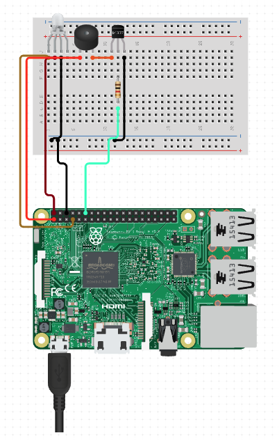

# GH Release Paniker

A simple Raspberry Pi Integrated GitHub Action, which paniks and lights up if your release build fails to build.


## Usage

**Requirements:**

Raspberry Pi, LED, Buzzer, Internet connection, Router with port-forwarding capabilities and some patience :D

- **Step 1: Assembling the Circuit**
  
  Assemble the Circuit as given in the diagram

  

- **Step 2: Installing the FastAPI Server**
  Clone the repo using the comment `git clone https://github.com/DarthBenro008/gh-release-paniker` in your Raspberry Pi

  Run the following commands:

  ```bash
  cd server
  pip install -r requirements.txt
  unvicorn main:app --host=0.0.0.0 --port=3000
  ```
- **Step 3: Port forward and get the IP Address of your Raspberry Pi**
  
  Go to your Router settings and port forward the IP address of your Raspbery Pi on port 3000

  *Warning: Port forwarding exposes your raspberry pi to the internet, ensure you do not have any sensitive data or server running on it*

- **Step 4: Pick a GitHub Action workflow from this repository**

  From the `.github/workflows` folder, you have various workflows to pick for your project, pick one and replace the public IP in the last line where it asks you to replace

- **Step 5: Hope this setup never buzzes! and may your releases always succedd**


## Actions Available

This repository contains various GitHub Actions that help Open-Source projects release a new version of their project with a single command. 

This repository contains the following:

- [**`rust-releaser`** ](.github/workflows/rust-releaser.yaml)
- [**`golang-releaser`**](.github/workflows/golang-releaser.yaml)
- [**`hugo-releaser`**](.github/workflows/hugo-releaser.yaml)
- [**`android-releaser`**](.github/workflows/android-releaser.yaml)

## Use Cases

| Workflow Name    | Description                                                                                            | Builds and releases across multiple OS/Platforms in a single command | What triggers the workflow?                                          |
|------------------|--------------------------------------------------------------------------------------------------------|----------------------------------------------------------------------|----------------------------------------------------------------------|
| rust-releaser    | Release your rust based application across linux, windows, macOS in a single command with changelogs   | Yes                                                                  | on push of tags starting with "v", eg: v1.0, v0.1.1                  |
| golang-releaser  | Release your Golang based application across linux, windows, macOS in a single command with changelogs | Yes                                                                  | on push of tags starting with "v", eg: v1.0, v0.1.1                  |
| hugo-releaser    | Release your Hugo website to GitHub pages in a single command                                          | Yes                                                                  | on push to master/main branch                                        |
| android-releaser | Build, Release and Test your android app and get it delivered on Telegram Channel of your choice       | Yes                                                                  | on push to master/main branch, and on push of tags starting with "v" |

## GitHub Actions featured in this repository

- actions/checkout@v1
- actions-rs/toolchain@v1
- actions/setup-go@v2
- softprops/action-gh-release@v1
- peaceiris/actions-hugo@v2
- peaceiris/actions-gh-pages@v3
- DarthBenro008/app-brickie@v3.1